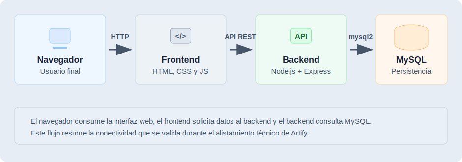
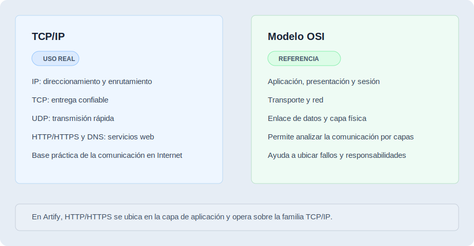

# Conceptos y Principios de Hardware e Instalación de Software

> **Proyecto:** Artify - Editor de Imágenes Web
> **Programa:** Análisis y Desarrollo de Software - SENA
> **Evidencia:** GA10-220501097-AA1-EV01
> **Autor:** Iván Darío Madrid Daza
> **Fecha:** Mayo 2026

---

## 1. Introducción

En este documento presento un artefacto académico-técnico relacionado con la evidencia de conocimiento GA10-220501097-AA1-EV01, enfocada en conceptos y principios de hardware e instalación de software.

El propósito es relacionar el proyecto Artify con conceptos básicos de infraestructura tecnológica, redes, networking, medios de transmisión y protocolos de comunicación. Para lograrlo, tomo como referencia el entorno de trabajo usado durante el desarrollo y explico cómo se prepara una plataforma local para ejecutar, probar y validar una aplicación web.

### 1.1 Cobertura de la evidencia

| Requisito solicitado | Ubicación en el documento |
| --- | --- |
| Selección de la plataforma | Sección 2 |
| Características del sistema operativo seleccionado | Sección 3 |
| Organizaciones que construyen estándares de redes y networking | Sección 5 |
| Protocolos relacionados con transmisión y recepción de datos | Sección 6 |
| Medios de transmisión guiados y no guiados | Sección 7 |
| Relación con alistamiento de infraestructura tecnológica | Sección 8 |
| Conclusión y referencias básicas | Secciones 9 y 10 |

---

## 2. Selección de la Plataforma

Para esta evidencia selecciono macOS como sistema operativo del entorno de trabajo, desarrollo y alistamiento. La elección se realiza porque es la plataforma desde la cual preparo Artify, ejecuto comandos, instalo herramientas y valido el funcionamiento local del sistema.

Esta selección no significa que la aplicación dependa de macOS para el usuario final. En este documento, macOS se toma como plataforma de referencia para describir el proceso técnico de preparación del ambiente.

La plataforma seleccionada se compone de:

| Elemento | Selección |
| --- | --- |
| Sistema operativo | macOS |
| Aplicación evaluada | Artify |
| Tipo de aplicación | Aplicación web |
| Entorno de ejecución del usuario | Navegador web moderno |
| Entorno de trabajo técnico | macOS con herramientas de desarrollo |
| Backend | Node.js + Express |
| Base de datos | PostgreSQL |
| Control de versiones | Git y GitHub |

---

## 3. Características del Sistema Operativo Seleccionado

macOS es un sistema operativo adecuado para el alistamiento técnico porque permite instalar herramientas de desarrollo web, administrar servicios locales y trabajar con conectividad de red desde una terminal integrada.

Para esta evidencia, las características relevantes del sistema operativo seleccionado son:

- Permite instalar y ejecutar herramientas de desarrollo como Node.js, pnpm, Git y PostgreSQL.
- Incluye una terminal que facilita la ejecución de comandos, pruebas y scripts.
- Soporta navegadores modernos para probar aplicaciones web.
- Permite trabajar con redes locales, puertos, servicios y conexiones HTTP.
- Facilita la integración con editores de código y sistemas de control de versiones.
- Permite verificar servicios locales, como backend, frontend y base de datos.

En el caso de Artify, estas características permiten preparar el backend, servir el frontend, conectarse a PostgreSQL y verificar que la aplicación responda correctamente desde el navegador.

---

## 4. Relación de Artify con el Entorno Web

Artify está diseñado como una aplicación web. Esto significa que el usuario final no necesita instalarlo como un programa nativo del sistema operativo. El acceso se realiza desde un navegador moderno conectado al servidor donde se ejecuta la aplicación.

Esta característica permite separar dos conceptos:

| Concepto | Explicación |
| --- | --- |
| Sistema operativo del usuario final | Puede ser macOS, Windows, Linux u otro sistema compatible con navegadores modernos. |
| Sistema operativo del entorno de trabajo | Para esta evidencia se selecciona macOS porque allí se prepara, ejecuta y valida el proyecto. |

De esta forma, la relación entre Artify y el sistema operativo se divide en dos niveles: el usuario final accede desde el navegador, mientras que el entorno técnico requiere una plataforma preparada para ejecutar servicios, instalar dependencias y validar la comunicación entre componentes.

---

## 5. Organizaciones que Construyen Estándares de Redes y Networking

Las redes de computadores funcionan correctamente porque existen estándares que permiten la comunicación entre dispositivos, sistemas operativos, aplicaciones y fabricantes diferentes. Estos estándares definen reglas comunes para transmisión de datos, direccionamiento, seguridad, conectividad, interoperabilidad y funcionamiento de servicios.

Algunas organizaciones importantes en redes y networking son:

| Organización | Aporte principal |
| --- | --- |
| IEEE | Define estándares para redes físicas y de enlace, como Ethernet y Wi-Fi. |
| IETF | Desarrolla estándares de Internet, incluyendo protocolos como IP, TCP, UDP, HTTP y DNS mediante documentos RFC. |
| ISO | Propone modelos y estándares internacionales, como el modelo de referencia OSI. |
| ITU-T | Trabaja en estándares de telecomunicaciones y transmisión de datos. |
| W3C | Define estándares para la Web, como HTML, CSS y recomendaciones relacionadas con accesibilidad e interoperabilidad web. |
| ICANN | Coordina elementos de nombres de dominio y direcciones en Internet. |

Estas organizaciones permiten que una aplicación web como Artify pueda ejecutarse sobre tecnologías estandarizadas. Por ejemplo, el navegador interpreta HTML, CSS y JavaScript, mientras que la comunicación con el backend se realiza mediante protocolos de red ampliamente aceptados.

---

## 6. Familia TCP/IP y Modelo OSI en la Comunicación de Datos

En redes y networking, los datos se transmiten y reciben mediante reglas organizadas. En esta evidencia se diferencia la familia TCP/IP, que agrupa protocolos usados directamente en Internet y redes actuales, del modelo OSI, que funciona como una referencia conceptual para comprender la comunicación por capas.

### 6.1 Familia TCP/IP

La familia TCP/IP es la base principal de Internet y de muchas redes actuales. Permite direccionar dispositivos, dividir datos en paquetes, transportarlos y entregarlos a las aplicaciones correspondientes.

Algunos protocolos de esta familia son:

| Protocolo | Función |
| --- | --- |
| IP | Permite direccionar y enrutar paquetes entre redes. |
| TCP | Ofrece comunicación confiable, orientada a conexión y con control de entrega. |
| UDP | Permite comunicación rápida, sin conexión y con menor sobrecarga. |
| HTTP/HTTPS | Permite la comunicación entre navegadores y servidores web. |
| DNS | Traduce nombres de dominio a direcciones IP. |

En Artify, esta familia de protocolos se relaciona con el acceso desde el navegador al frontend y con las peticiones HTTP que el frontend realiza al backend.

### 6.2 Modelo OSI

El modelo OSI no es una pila de protocolos usada de forma directa como TCP/IP, pero sí funciona como una referencia conceptual para comprender cómo se organiza la comunicación en redes. Divide el proceso en capas, desde la transmisión física de señales hasta la interacción con aplicaciones.

Las capas del modelo OSI son:

| Capa | Descripción |
| --- | --- |
| 1. Física | Transmite bits por medios físicos o inalámbricos. |
| 2. Enlace de datos | Organiza tramas y controla acceso al medio. |
| 3. Red | Gestiona direccionamiento y enrutamiento. |
| 4. Transporte | Controla la entrega de datos entre origen y destino. |
| 5. Sesión | Administra sesiones de comunicación. |
| 6. Presentación | Define representación, codificación o cifrado de datos. |
| 7. Aplicación | Permite la interacción con servicios de red y aplicaciones. |

Para Artify, este modelo ayuda a comprender que la aplicación web funciona sobre varias capas: desde el medio físico de conexión hasta el protocolo HTTP que usa el navegador.

---

## 7. Medios de Transmisión Guiados y no Guiados

Los medios de transmisión son los canales por los cuales viajan los datos dentro de una red. En el siguiente esquema se resume su clasificación, sus ejemplos principales y su relación con el acceso web a Artify.

---

## 8. Relación con el Alistamiento de Infraestructura Tecnológica

En la fase de implantación, el alistamiento de infraestructura tecnológica consiste en preparar los recursos necesarios para que el sistema pueda funcionar correctamente. En el caso de Artify, este alistamiento incluye tanto software como condiciones de red.

Elementos importantes:

| Componente | Herramienta o recurso | Propósito dentro del alistamiento |
| --- | --- | --- |
| Sistema operativo | macOS | Preparar el entorno técnico de trabajo y ejecutar herramientas locales. |
| Backend | Node.js, Express y pnpm | Instalar dependencias, ejecutar el servidor y exponer la API. |
| Frontend | Navegador moderno y servidor local | Probar la interfaz web y validar el acceso del usuario final. |
| Base de datos | PostgreSQL | Almacenar usuarios, sesiones, configuraciones y operaciones. |
| Red local | HTTP, puertos `3000` y `8080` | Verificar comunicación entre navegador, frontend y backend. |
| Configuración | Variables de entorno | Definir credenciales, puerto, secreto de token y conexión a base de datos. |
| Control de versiones | Git y GitHub | Mantener trazabilidad de cambios y documentación del proyecto. |

Esta preparación permite confirmar que Artify no solo cuenta con código funcional, sino también con un entorno técnico capaz de ejecutarlo, probarlo y mantenerlo.

---

## 9. Conclusión

Después de revisar los conceptos de plataforma, sistema operativo, estándares de red, protocolos y medios de transmisión, concluyo que Artify se apoya en principios fundamentales de infraestructura tecnológica y networking para funcionar correctamente como aplicación web.

macOS es una plataforma adecuada para el entorno de trabajo y alistamiento porque permite instalar las herramientas necesarias, ejecutar servicios locales y validar el funcionamiento del sistema. Sin embargo, Artify no queda limitado a macOS para el usuario final, ya que su acceso se realiza desde navegadores modernos en diferentes sistemas operativos.

También identifico que los estándares definidos por organizaciones como IEEE, IETF, ISO, ITU-T y W3C son esenciales para que las aplicaciones web puedan comunicarse de manera interoperable. Además, los protocolos de la familia TCP/IP y el modelo OSI permiten comprender cómo viajan los datos desde el usuario hasta los servicios que componen el sistema.

En conjunto, estos conceptos fortalecen la comprensión del alistamiento de infraestructura tecnológica necesario para llevar una aplicación web desde el desarrollo hacia un entorno preparado para pruebas, implantación y uso. Esta evidencia me permite relacionar los conceptos de hardware, software y redes con el proceso real de preparación técnica del proyecto Artify.

---

## 10. Referencias Básicas

- Apple Developer Documentation. Documentación técnica de macOS y herramientas para desarrolladores.
- IEEE Standards Association. Estándares IEEE 802 relacionados con Ethernet y Wi-Fi.
- RFC Editor / IETF. Documentos RFC usados para definir estándares y protocolos de Internet.
- ISO. Estándares internacionales y modelo de referencia OSI.
- ITU-T. Recomendaciones técnicas para telecomunicaciones y transmisión de datos.
- W3C Standards. Recomendaciones y estándares para tecnologías web como HTML, CSS y accesibilidad.
- SENA. Material de formación sobre infraestructura tecnológica, redes, hardware, software y alistamiento de sistemas.
