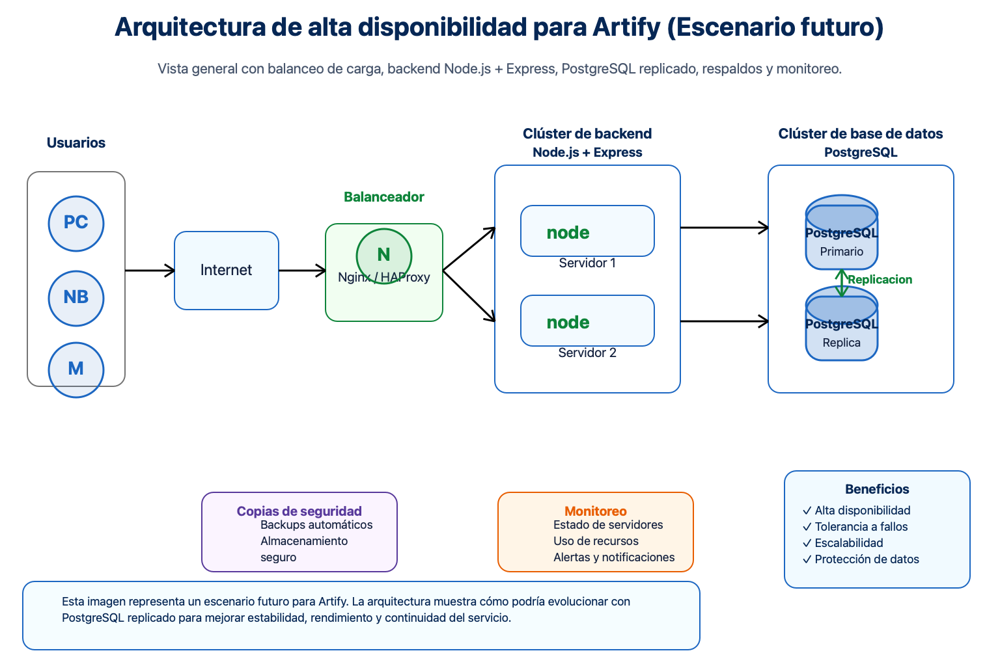
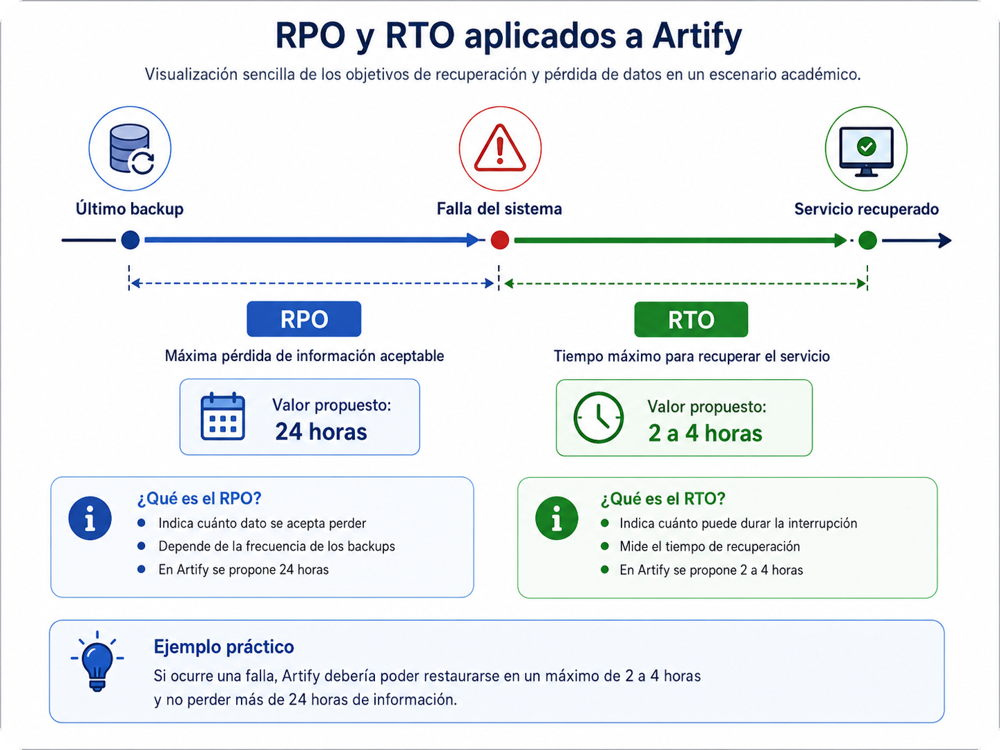
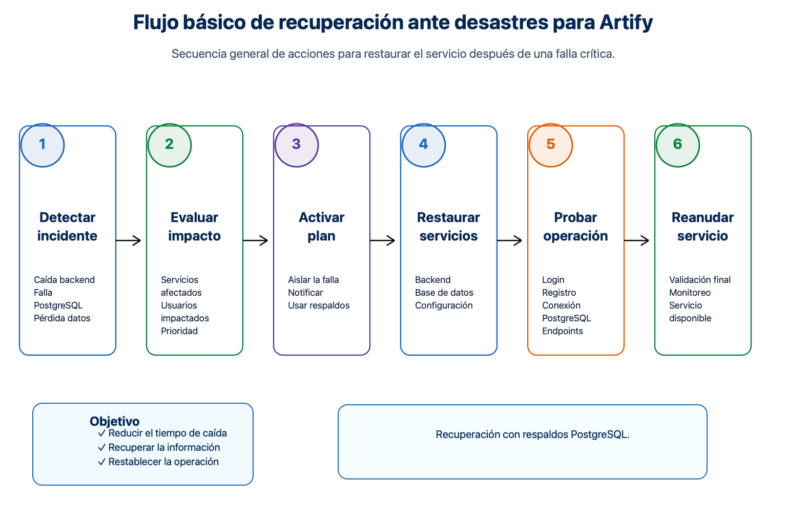
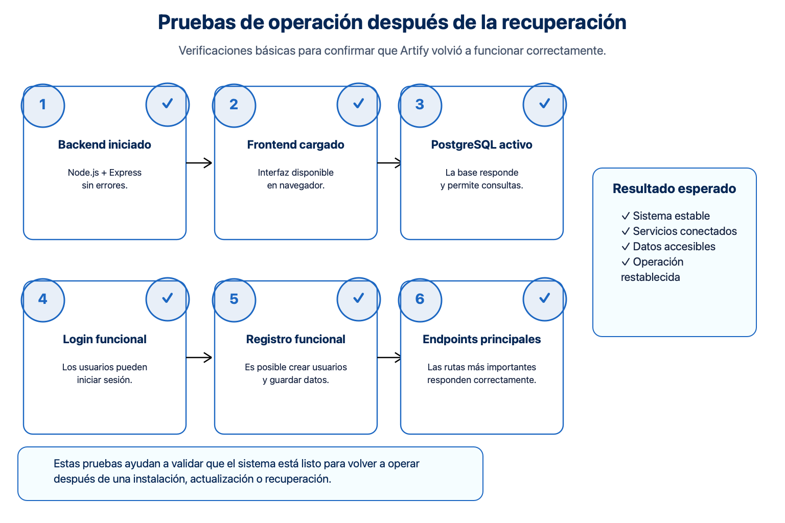

# Configuración de servicios, clústeres y alta disponibilidad para Artify

> **Proyecto:** Artify - Editor de Imágenes Web
> **Evidencia:** GA10-220501097-AA4-EV01 - Conceptos y principios acerca de configuración de servicios
> **Programa:** Análisis y Desarrollo de Software - SENA
> **Autor:** Iván Darío Madrid Daza
> **Fecha:** Junio 2026

---

## 1. Introducción

En este informe presento conceptos relacionados con la configuración de servicios, clústeres, redundancia, alta disponibilidad y recuperación ante fallos. Estos temas se analizan como una base técnica para comprender cómo una aplicación web puede prepararse para mantener su operación cuando se presentan errores, caídas o crecimiento en el número de usuarios.

También relaciono estos conceptos con Artify, no como una implementación actual de clústeres, sino como un análisis de posible aplicación futura. De esta manera, el documento permite proyectar el sistema hacia escenarios donde sea necesario mejorar la estabilidad, la continuidad del servicio y la capacidad de recuperación.

---

## 2. Objetivo

Explicar los conceptos principales de clústeres, redundancia, alta disponibilidad, recuperación de desastres, RPO, RTO y continuidad del servicio, relacionándolos con la arquitectura de Artify como aplicación web académica construida con frontend, backend y base de datos.

---

## 3. Relación de Artify con la configuración de servicios

Artify es una aplicación web organizada en componentes principales: un frontend construido con HTML, CSS y JavaScript, un backend desarrollado con Node.js y Express, y una base de datos PostgreSQL para almacenar la información del sistema.

En su estado actual, Artify se trabaja como un proyecto académico y no utiliza clústeres. Sin embargo, considero importante analizar estos conceptos porque podrían aplicarse en un escenario futuro si el sistema crece, recibe más usuarios o requiere mayor disponibilidad. Por ejemplo, se podría separar el frontend, el backend y la base de datos en servicios diferentes, usar un balanceador de carga o implementar copias de seguridad automatizadas.

---

  

## 4. Concepto de clúster

Un clúster es un conjunto de servidores, máquinas o nodos que trabajan de forma coordinada para ofrecer un servicio de manera más estable, rápida o tolerante a fallos. En lugar de depender de un solo servidor, el sistema puede distribuir tareas o mantener servicios de respaldo para reducir el riesgo de interrupción.

En infraestructura tecnológica, los clústeres sirven para mejorar la disponibilidad, repartir carga de trabajo, aumentar la capacidad de procesamiento y facilitar la recuperación cuando un componente falla. En una aplicación como Artify, este concepto podría ser útil en el futuro para mantener disponible el backend, proteger la base de datos y asegurar que los usuarios puedan seguir accediendo al servicio.

---

## 5. Herramientas y tecnologías usadas en arquitecturas de clústeres

| Herramienta o tecnología | Uso principal |
| --- | --- |
| Nginx o HAProxy | Distribuir solicitudes entre varios servidores y actuar como balanceador de carga. |
| Docker | Empaquetar aplicaciones y servicios en contenedores portables. |
| Kubernetes | Orquestar contenedores, escalar servicios y recuperar instancias fallidas. |
| PostgreSQL Replication | Replicar datos entre servidores PostgreSQL para mejorar disponibilidad y respaldo. |
| Backups | Crear copias de seguridad para recuperar información ante fallos o pérdida de datos. |
| Monitoreo | Revisar el estado de servidores, servicios, base de datos y consumo de recursos. |
| Servicios cloud o VPS | Alojar aplicaciones en servidores remotos con mayor control y escalabilidad. |

---

## 6. Características de los clústeres

- **Alta disponibilidad:** permite que un servicio continúe funcionando aunque uno de sus componentes falle.
- **Redundancia:** consiste en tener componentes duplicados o de respaldo para evitar depender de un único punto de falla.
- **Tolerancia a fallos:** permite detectar errores y continuar la operación usando otros nodos o servicios disponibles.
- **Escalabilidad:** facilita aumentar la capacidad del sistema agregando más recursos o servidores.
- **Balanceo de carga:** distribuye las solicitudes entre varios servidores para evitar sobrecargas.

---

## 7. Tipos de clústeres

- **Clúster de alta disponibilidad:** se enfoca en mantener el servicio activo incluso cuando ocurre una falla en un servidor.
- **Clúster de balanceo de carga:** reparte las solicitudes de los usuarios entre varios servidores para mejorar el rendimiento.
- **Clúster de alto rendimiento:** une varios equipos para resolver tareas que requieren gran capacidad de procesamiento.
- **Clúster de base de datos:** permite replicar, distribuir o proteger la información almacenada en sistemas como PostgreSQL.
- **Clúster de almacenamiento:** agrupa recursos de almacenamiento para mejorar capacidad, acceso y respaldo de datos.

---

## 8. Tipos de procesamiento en clústeres

- **Procesamiento distribuido:** divide tareas entre diferentes nodos para que cada uno realice una parte del trabajo.
- **Procesamiento paralelo:** ejecuta varias operaciones al mismo tiempo para reducir el tiempo total de procesamiento.
- **Procesamiento transaccional:** administra operaciones que deben completarse correctamente, como registros, inicios de sesión o guardado de datos.
- **Procesamiento en tiempo real:** permite responder rápidamente a eventos o solicitudes que requieren atención inmediata.

---

## 9. Riesgos, impacto y prioridad en Artify

| Riesgo | Impacto | Prioridad | Medida preventiva |
| --- | --- | --- | --- |
| Caída del backend | Los usuarios no podrían iniciar sesión ni usar funciones conectadas a la API. | Alta | Documentar el arranque del backend, monitorear el servicio y considerar reinicio automático en un entorno futuro. |
| Falla de PostgreSQL | El sistema no podría consultar ni guardar información persistente. | Alta | Realizar copias de seguridad y documentar el proceso de restauración de la base de datos. |
| Pérdida de datos | Se podrían perder usuarios, configuraciones, sesiones u operaciones registradas. | Alta | Programar backups periódicos y conservar copias en ubicaciones seguras. |
| Falla de red | El frontend no podría comunicarse correctamente con el backend o la base de datos. | Media | Verificar conectividad, puertos, variables de entorno y configuración de red. |
| Error de configuración | El sistema podría fallar por credenciales, rutas o variables incorrectas. | Media | Documentar variables de entorno, revisar archivos de configuración y probar el despliegue después de cada ajuste. |

---

## 10. Recuperación de desastres, RPO y RTO

La recuperación de desastres es el conjunto de acciones que permiten restaurar un sistema después de una falla grave, como pérdida de datos, caída de servidores, errores de configuración o problemas de infraestructura. Su propósito es reducir el impacto de la interrupción y permitir que el servicio vuelva a operar de forma ordenada.

El **RPO** indica cuánta información se acepta perder como máximo. Por ejemplo, si se define un RPO de 24 horas, significa que el sistema debería contar con copias de seguridad suficientes para no perder más de un día de información.

El **RTO** indica cuánto tiempo máximo puede estar caído el sistema antes de ser recuperado. Si se define un RTO de 2 a 4 horas, significa que el objetivo sería restaurar el servicio dentro de ese rango de tiempo.

Para Artify, como proyecto académico, propongo los siguientes valores de referencia:

| Indicador | Valor propuesto | Justificación |
| --- | --- | --- |
| RPO | 24 horas | Permite trabajar con copias de seguridad diarias en un contexto académico. |
| RTO | 2 a 4 horas | Es un tiempo razonable para restaurar backend, base de datos y frontend en un entorno controlado. |

  

---

## 11. Plan básico de continuidad para Artify

Para fortalecer la continuidad de Artify, propongo aplicar acciones básicas que permitan recuperar el proyecto si se presenta una falla:

- Mantener el código fuente actualizado en GitHub.
- Realizar copias de seguridad periódicas de la base de datos PostgreSQL.
- Documentar las variables de entorno necesarias para ejecutar el backend.
- Conservar pasos claros de reinstalación del proyecto.
- Verificar que el frontend pueda comunicarse correctamente con el backend.
- Probar login, registro, endpoints principales y conexión a la base de datos después de una recuperación.
- Registrar cambios importantes en configuración para facilitar futuras revisiones.

  

---

## 12. Ventajas y desventajas de las arquitecturas de clústeres

| Ventajas | Desventajas |
| --- | --- |
| Mejoran la disponibilidad del servicio. | Requieren mayor conocimiento técnico para su configuración. |
| Reducen el riesgo de caída total del sistema. | Pueden aumentar los costos de infraestructura. |
| Permiten distribuir carga entre varios servidores. | Necesitan monitoreo y mantenimiento constante. |
| Facilitan la escalabilidad cuando crece el número de usuarios. | Su administración puede ser más compleja que la de un servidor único. |
| Ayudan a planear recuperación ante fallos. | Una mala configuración puede generar errores difíciles de diagnosticar. |

---

## 13. Aplicación futura en Artify

Si Artify crece y requiere mayor estabilidad, podría beneficiarse de una arquitectura más preparada para alta disponibilidad. En ese escenario, considero que se podrían aplicar las siguientes mejoras:

- Separar el frontend, el backend y la base de datos en servicios independientes.
- Usar un balanceador de carga como Nginx o HAProxy para distribuir solicitudes hacia el backend.
- Replicar la base de datos PostgreSQL para mejorar la disponibilidad de la información.
- Automatizar copias de seguridad de la base de datos y de archivos importantes.
- Monitorear servicios, consumo de recursos, disponibilidad de la API y estado de PostgreSQL.
- Documentar procedimientos de recuperación para que el sistema pueda restaurarse con mayor rapidez.

Estas acciones no son obligatorias en la etapa actual del proyecto, pero sirven como referencia para una posible evolución técnica de Artify.

---

## 14. Pruebas de operación

Las pruebas de operación permiten comprobar que los servicios principales funcionan después de una instalación, actualización o recuperación. En Artify, estas pruebas ayudan a validar que el sistema está listo para usarse.

Para un escenario básico, propongo verificar:

- Que el backend inicie sin errores.
- Que el frontend cargue correctamente en el navegador.
- Que el registro de usuarios funcione.
- Que el inicio de sesión responda correctamente.
- Que la conexión con PostgreSQL esté activa.
- Que las rutas principales del backend respondan.
- Que los datos puedan guardarse y consultarse después de una restauración.

  

Estas pruebas permiten detectar fallos de configuración antes de considerar que el sistema está recuperado o disponible.

---

## 15. Conclusión

En este informe analicé los conceptos de clústeres, redundancia, alta disponibilidad, recuperación de desastres, RPO, RTO y continuidad del negocio aplicados como referencia técnica para Artify. Aunque el proyecto actualmente no usa clústeres, estos conceptos permiten comprender cómo podría evolucionar hacia una infraestructura más estable, confiable y preparada ante fallos.

Considero que la aplicación futura de balanceadores de carga, respaldos, monitoreo y replicación de base de datos podría fortalecer la operación de Artify si el sistema crece o requiere mayor disponibilidad.

---

## 16. Referencias básicas

- Amazon Web Services. Conceptos generales sobre alta disponibilidad, recuperación de desastres, RPO y RTO.
- Cloudflare. Conceptos sobre balanceo de carga, disponibilidad y tolerancia a fallos.
- Docker. Documentación general sobre contenedores y despliegue de aplicaciones.
- Kubernetes. Documentación general sobre orquestación de contenedores y escalabilidad.
- PostgreSQL. Documentación sobre PostgreSQL Replication y mecanismos de respaldo.
- Nginx. Documentación sobre servidor web, proxy inverso y balanceo de carga.
- Red Hat. Conceptos generales sobre clústeres, alta disponibilidad e infraestructura escalable.
