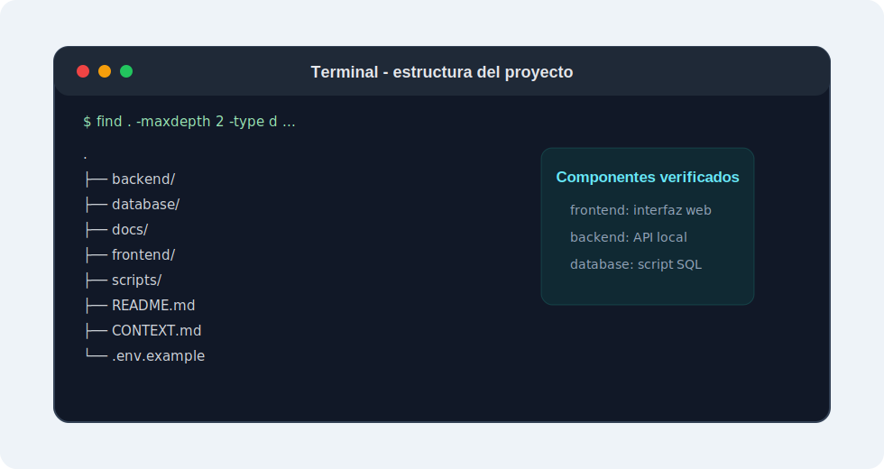
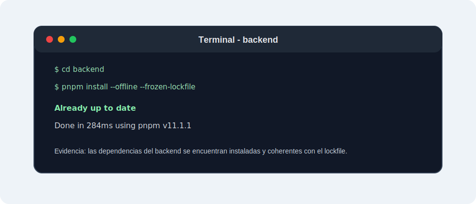
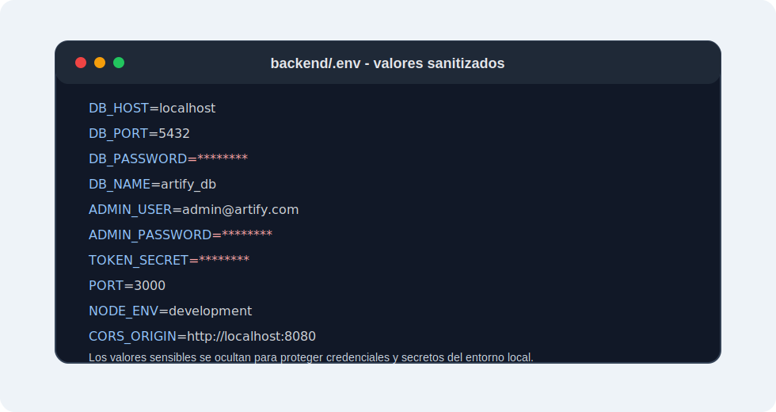
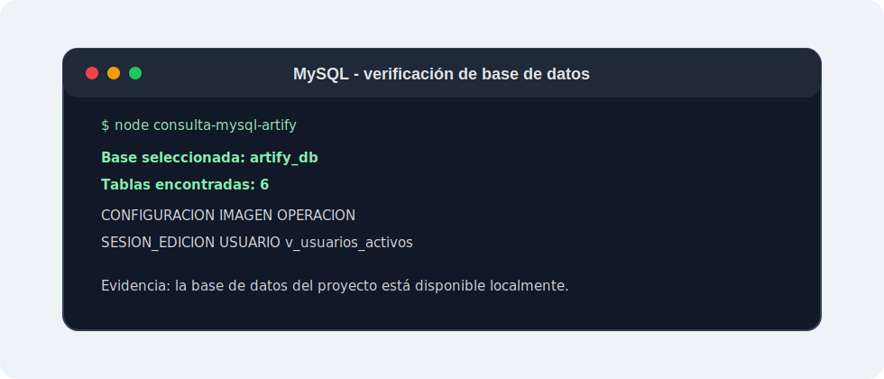
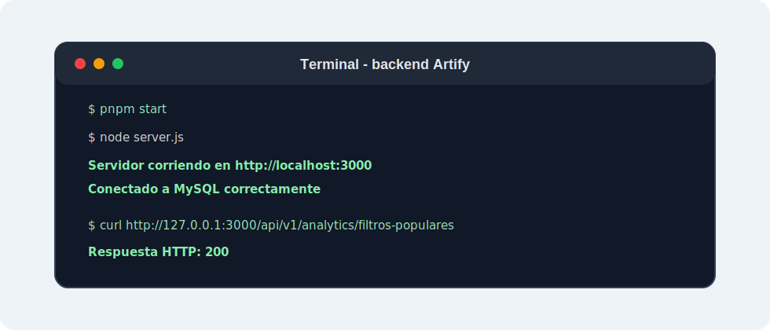

# Plan de Instalación Local de Artify

> **Proyecto:** Artify - Editor de Imágenes Web
> **Evidencia:** GA10-220501097-AA3
> **Programa:** Análisis y Desarrollo de Software - SENA
> **Autor:** Iván Darío Madrid Daza
> **Fecha:** Mayo 2026

---

## 1. Introducción

En este informe elaboro el plan de instalación local de Artify como aplicación web. Para esta evidencia selecciono Node.js como plataforma principal de desarrollo e implantación, porque corresponde directamente con la arquitectura actual del proyecto y permite ejecutar el backend construido con Express.

Realizo el proceso de instalación local teniendo en cuenta el backend, la base de datos y el frontend del proyecto. También incluyo los pasos necesarios para preparar herramientas, configurar variables de entorno, cargar la base de datos, iniciar los servicios y verificar que el sistema funcione correctamente.

### 1.1 Cobertura de la evidencia

| Requisito solicitado | Ubicación en el documento |
| --- | --- |
| Selección de plataforma de desarrollo e implantación | Secciones 3 y 4 |
| Montaje de servidor de aplicaciones local | Secciones 8 y 9 |
| Identificación de componentes de arquitectura | Sección 6 |
| Requisitos previos de instalación | Sección 5 |
| Paso a paso para instalar y montar el producto | Sección 8 |
| Comandos sugeridos para instalación local | Sección 9 |
| Imágenes descriptivas o capturas de pantalla | Sección 8 |
| Verificación del despliegue local | Sección 10 |
| Requisitos no funcionales relacionados | Sección 11 |
| Consideración sobre máquinas virtuales y contenedores | Sección 12 |

---

## 2. Objetivo

Elaborar el paso a paso para instalar y preparar el entorno local necesario para desplegar Artify, incluyendo la instalación de herramientas, configuración del backend, preparación de la base de datos, ejecución del frontend y verificación del funcionamiento del sistema.

---

## 3. Plataforma Seleccionada

Para esta evidencia selecciono Node.js como plataforma principal de desarrollo e implantación local. Esta decisión se toma porque Artify utiliza JavaScript en el backend mediante Node.js y Express, lo que permite ejecutar una API local conectada a una base de datos MySQL.

La plataforma seleccionada se complementa con los siguientes componentes:

| Componente | Función dentro del plan |
| --- | --- |
| Node.js | Ejecutar el backend de Artify. |
| Express | Construir y exponer la API del sistema. |
| MySQL | Almacenar usuarios, sesiones, configuraciones y operaciones. |
| pnpm | Instalar dependencias y ejecutar scripts del backend. |
| Git | Clonar y versionar el proyecto. |
| Navegador web | Acceder al frontend y validar el sistema. |
| Servidor HTTP local | Servir los archivos estáticos del frontend durante la prueba local. |

Aunque existen otras alternativas para montar entornos locales, como paquetes integrados, máquinas virtuales o contenedores, para esta evidencia selecciono Node.js porque corresponde directamente con la arquitectura real de Artify.

---

## 4. Justificación de la Plataforma

Node.js es una plataforma adecuada para Artify porque permite ejecutar JavaScript fuera del navegador y construir servicios backend para aplicaciones web. En este proyecto se integra con Express para crear rutas, procesar solicitudes HTTP, validar usuarios y comunicarse con MySQL.

Selecciono Node.js por las siguientes razones:

- Permite usar JavaScript en el backend del proyecto.
- Se integra directamente con Express.
- Facilita la creación de APIs para el frontend.
- Permite trabajar en un entorno local de desarrollo e implantación.
- Es compatible con la conexión a MySQL mediante paquetes de Node.js.
- Se ajusta a la arquitectura actual de Artify sin requerir cambiar de tecnología.

---

## 5. Requisitos Previos

Antes de instalar Artify en un entorno local, debo verificar que el equipo tenga las herramientas necesarias para ejecutar el backend, administrar la base de datos y abrir la aplicación desde un navegador.

| Requisito | Versión o condición recomendada | Uso en la instalación |
| --- | --- | --- |
| Sistema operativo | Windows, macOS o Linux | Ejecutar herramientas de desarrollo local. |
| Node.js | 22.13 o superior | Ejecutar el backend de Artify. |
| pnpm | 11.1.1 | Instalar dependencias y ejecutar scripts del backend. |
| MySQL | 8.0 o superior | Crear y consultar la base de datos `artify_db`. |
| Git | Versión estable | Clonar el repositorio del proyecto. |
| Navegador web | Chrome, Edge, Firefox, Safari u otro moderno | Abrir y probar el frontend. |
| Editor de código | Visual Studio Code u otro editor | Revisar archivos y configuración. |
| Terminal | Terminal del sistema operativo | Ejecutar comandos de instalación y arranque. |

---

## 6. Componentes de Arquitectura Usados en Artify

Artify se organiza como una aplicación web con separación entre frontend, backend y base de datos. Esta separación permite instalar y verificar cada componente de forma ordenada.

| Componente | Descripción |
| --- | --- |
| Frontend | Interfaz construida con HTML, CSS y JavaScript Vanilla. |
| Backend | Servidor Node.js + Express encargado de la API y la lógica de negocio. |
| Base de datos | MySQL, donde se almacena la información persistente del sistema. |
| API | Conjunto de rutas que comunican el frontend con el backend. |
| Variables de entorno | Configuración de credenciales, puerto, secreto de token y conexión a MySQL. |
| Navegador cliente | Medio desde el cual el usuario accede a la aplicación. |
| Servidor local | Entorno donde se ejecutan backend, frontend y base de datos durante la instalación. |

---

## 7. Preparación del Entorno Local

Antes de ejecutar Artify, debo confirmar que las herramientas instaladas respondan correctamente desde la terminal. Esta revisión inicial reduce errores durante el montaje del producto.

```bash
node -v
pnpm -v
git --version
mysql --version
```

Si alguna herramienta no responde, debo instalarla o corregir su configuración antes de continuar con el despliegue local.

---

## 8. Paso a Paso de Instalación Local

### 8.1 Clonar el repositorio

El primer paso consiste en obtener el código fuente del proyecto desde el repositorio.

```bash
git clone https://github.com/Tecno85/artify-sena.git
cd artify-sena
```

### 8.2 Revisar la estructura del proyecto

Después de entrar a la carpeta del proyecto, reviso que existan las carpetas principales: `frontend/`, `backend/`, `database/`, `docs/` y `scripts/`.

#### Imagen 1. Estructura general del proyecto Artify



*Descripción:* En esta captura muestro la estructura general del proyecto, donde se identifican los componentes principales usados para la instalación local.

### 8.3 Instalar dependencias del backend

Las dependencias del backend se instalan dentro de la carpeta `backend/` usando `pnpm`, que es el gestor definido para este proyecto.

```bash
cd backend
pnpm install
```

#### Imagen 2. Instalación de dependencias con pnpm



*Descripción:* En esta captura evidencio la instalación de dependencias necesarias para ejecutar el backend de Artify.

### 8.4 Configurar variables de entorno

El backend necesita un archivo `.env` dentro de `backend/`. Este archivo contiene la configuración de conexión a MySQL, credenciales administrativas, puerto del servidor y secreto usado para firmar tokens.

```bash
cp ../.env.example .env
```

Ejemplo de configuración sin datos sensibles reales:

```env
DB_HOST=localhost
DB_USER=root
DB_PASSWORD=contraseña_mysql
DB_NAME=artify_db
ADMIN_USER=admin@artify.com
ADMIN_PASSWORD=contraseña_admin
TOKEN_SECRET=secreto_largo_y_aleatorio
PORT=3000
NODE_ENV=development
```

#### Imagen 3. Archivo `.env` configurado



*Descripción:* En esta captura muestro la configuración necesaria para conectar el backend con MySQL y definir variables requeridas por Artify, protegiendo los datos sensibles.

### 8.5 Crear o seleccionar la base de datos MySQL

Artify requiere una base de datos llamada `artify_db`. Puedo crearla o seleccionarla desde la consola de MySQL o desde una herramienta gráfica como MySQL Workbench.

```sql
CREATE DATABASE IF NOT EXISTS artify_db;
USE artify_db;
```

### 8.6 Ejecutar el script SQL del proyecto

El script principal se encuentra en:

```text
database/artify_db.sql
```

Desde la raíz del proyecto puedo importarlo con:

```bash
mysql -u root -p < database/artify_db.sql
```

Luego verifico las tablas:

```sql
USE artify_db;
SHOW TABLES;
```

#### Imagen 4. Base de datos `artify_db` y tablas creadas



*Descripción:* En esta captura evidencio que la base de datos fue creada y que las tablas necesarias para Artify están disponibles.

### 8.7 Iniciar el backend

Después de instalar dependencias y configurar la base de datos, inicio el backend desde la carpeta `backend/`.

```bash
pnpm start
```

La salida esperada debe indicar que el servidor está activo y que la conexión a MySQL fue correcta.

```text
Conectado a MySQL correctamente
Servidor corriendo en http://localhost:3000
```

#### Imagen 5. Backend ejecutándose correctamente



*Descripción:* En esta captura muestro que el servidor backend de Artify se encuentra ejecutándose localmente y listo para recibir solicitudes.

### 8.8 Ejecutar el frontend

El frontend de Artify es estático. Para probarlo de forma local, puedo servir la carpeta `frontend/` mediante un servidor HTTP.

Desde la raíz del proyecto:

```bash
npx http-server frontend -p 8080
```

Luego abro en el navegador:

```text
http://127.0.0.1:8080
```

### 8.9 Probar una función básica

Con backend, base de datos y frontend activos, realizo una prueba funcional básica. Esta prueba puede ser abrir la pantalla inicial, registrar un usuario, iniciar sesión o validar que el frontend se comunique con el backend.

#### Imagen 6. Frontend abierto o prueba funcional


*Descripción:* En esta captura evidencio que Artify se abre correctamente desde el navegador y que el despliegue local permite probar una funcionalidad básica del sistema.

---

## 9. Comandos Sugeridos

Los siguientes comandos resumen las acciones principales para instalar y ejecutar Artify localmente.

| Acción | Comando |
| --- | --- |
| Clonar repositorio | `git clone https://github.com/Tecno85/artify-sena.git` |
| Entrar al proyecto | `cd artify-sena` |
| Entrar al backend | `cd backend` |
| Instalar dependencias | `pnpm install` |
| Iniciar backend | `pnpm start` |
| Validar sintaxis del backend | `pnpm run check` |
| Ejecutar pruebas automatizadas | `pnpm test` |
| Importar base de datos | `mysql -u root -p < database/artify_db.sql` |
| Seleccionar base de datos | `USE artify_db;` |
| Listar tablas | `SHOW TABLES;` |
| Servir frontend | `npx http-server frontend -p 8080` |

---

## 10. Verificación del Despliegue Local

Después de realizar la instalación, verifico que los componentes principales estén funcionando.

| Elemento verificado | Resultado esperado | Evidencia | Estado |
| --- | --- | --- | --- |
| Estructura del proyecto | Carpetas `frontend/`, `backend/`, `database/` y `docs/` disponibles. | Imagen 1 | Verificado |
| Dependencias backend | Instalación finalizada con `pnpm install`. | Imagen 2 | Verificado |
| Variables de entorno | Archivo `.env` configurado sin exponer datos sensibles. | Imagen 3 | Verificado |
| Base de datos | Base `artify_db` creada y tablas disponibles. | Imagen 4 | Verificado |
| Backend | Servidor activo en `http://localhost:3000`. | Imagen 5 | Verificado |
| Frontend | Aplicación disponible en `http://127.0.0.1:8080`. | Imagen 6 | Verificado |
| Prueba funcional | Carga inicial del frontend funcionando. | Imagen 6 | Verificado |

---

## 11. Requisitos no Funcionales Relacionados

El plan de instalación también debe considerar requisitos no funcionales que ayudan a mantener el sistema estable, seguro y fácil de mantener.

| Requisito no funcional | Relación con la instalación local |
| --- | --- |
| Rendimiento | El equipo local debe contar con recursos suficientes para ejecutar backend, MySQL y navegador. |
| Seguridad | El archivo `.env` debe proteger credenciales y no debe subirse al repositorio. |
| Disponibilidad local | Backend, frontend y MySQL deben estar activos durante la prueba. |
| Mantenibilidad | El uso de `pnpm`, scripts y documentación facilita repetir la instalación. |
| Escalabilidad básica | La separación entre frontend, backend y base de datos permite crecer en etapas posteriores. |
| Compatibilidad | El proyecto debe ejecutarse en sistemas compatibles con Node.js, MySQL y navegadores modernos. |

---

## 12. Consideración Sobre Máquinas Virtuales y Contenedores

En esta evidencia realizo el despliegue local directo usando Node.js, MySQL y un servidor HTTP para el frontend. Esta opción es coherente con la arquitectura actual de Artify y permite montar el producto sin agregar capas adicionales.

En una etapa futura también sería posible usar una máquina virtual o contenedores para aislar el entorno, controlar versiones de servicios y reproducir la instalación con mayor precisión. Sin embargo, para este plan selecciono una instalación local directa porque permite verificar de forma clara los componentes principales del proyecto.

---

## 13. Conclusión

Después de elaborar este plan de instalación, concluyo que Artify puede desplegarse localmente de forma ordenada si se preparan correctamente Node.js, pnpm, MySQL, Git, el backend, la base de datos y el frontend. La selección de Node.js como plataforma principal es adecuada porque coincide con la arquitectura real del proyecto y permite ejecutar el backend desarrollado con Express.

Este informe me permite organizar el proceso de instalación paso a paso, identificar los componentes técnicos necesarios y definir evidencias visuales para demostrar el montaje local del producto. Con estas actividades puedo validar que Artify funciona como aplicación web y que sus componentes principales se comunican correctamente en un entorno local.

---

## 14. Referencias Básicas

- Node.js Documentation. Documentación oficial del entorno de ejecución Node.js.
- Express Documentation. Documentación oficial del framework Express.
- MySQL Documentation. Documentación oficial de MySQL y sus herramientas.
- pnpm Documentation. Documentación oficial del gestor de paquetes pnpm.
- Git Documentation. Documentación oficial del sistema de control de versiones Git.
- Mozilla Developer Network. Referencias sobre aplicaciones web, JavaScript y navegadores.
- SENA. Material de formación relacionado con instalación de software, servidores de aplicaciones, plataformas de desarrollo e implantación.
