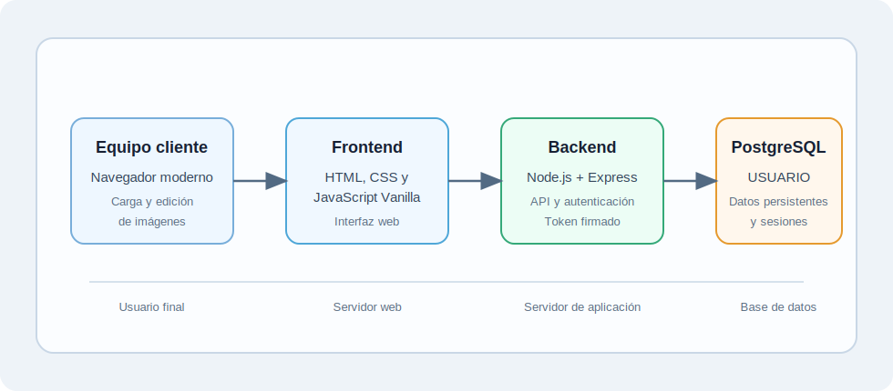
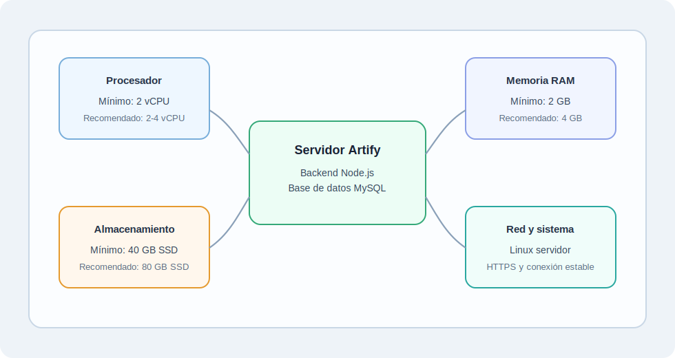
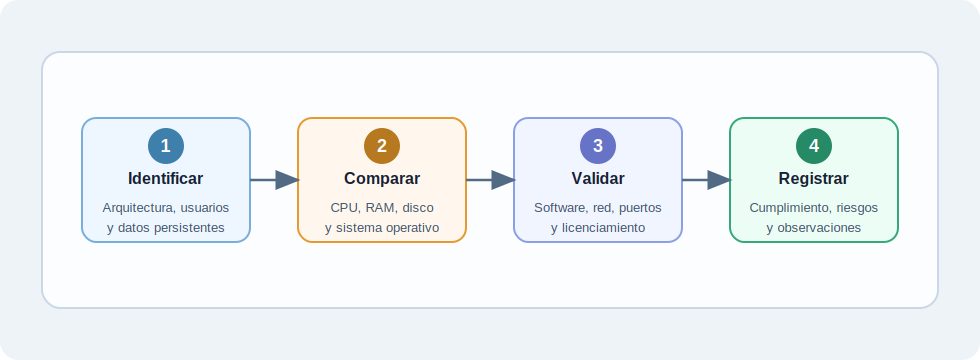

# Verificación de Características Mínimas de Hardware para Artify

> **Proyecto:** Artify - Editor de Imágenes Web
> **Evidencia:** GA10-220501097-AA2
> **Programa:** Análisis y Desarrollo de Software - SENA
> **Autor:** Iván Darío Madrid Daza
> **Fecha:** Mayo 2026

---

## 1. Introducción

En este informe verifico las características mínimas de hardware y software necesarias para desplegar Artify como aplicación web. Para esta evidencia tomo como referencia la arquitectura actual del proyecto, que está compuesta por una interfaz web desarrollada con HTML, CSS y JavaScript Vanilla, un backend construido con Node.js y Express, y una base de datos PostgreSQL para almacenar información persistente de usuarios, sesiones, configuraciones y operaciones.

Considero importante diferenciar entre el entorno servidor y el equipo cliente. El servidor debe ejecutar los servicios principales del sistema, mientras que el equipo cliente necesita un navegador moderno y recursos suficientes para interactuar con la aplicación y editar imágenes desde el navegador.

### 1.1 Cobertura de la evidencia

| Requisito solicitado | Ubicación en el documento |
| --- | --- |
| Aplicación web desarrollada en JavaScript | Secciones 3 y 9 |
| Acceso a información persistente para identificación y registro de usuario | Secciones 3, 6 y 11 |
| Características mínimas de hardware para despliegue | Sección 6 |
| Características recomendadas de hardware para estabilidad | Sección 7 |
| Requisitos del equipo cliente | Sección 8 |
| Requisitos de software, sistema operativo y herramientas | Secciones 9 y 12 |
| Requisitos de red y conectividad | Sección 10 |
| Consideración de 250 usuarios activos no concurrentes | Sección 11 |
| Licenciamiento de software | Sección 12 |
| Tabla de verificación de cumplimiento | Sección 13 |

---

## 2. Objetivo

Verificar los elementos mínimos de hardware, software, sistema operativo, red, almacenamiento y licenciamiento que debo considerar para desplegar correctamente Artify, teniendo en cuenta que es una aplicación web desarrollada en JavaScript, con autenticación de usuarios y acceso a información persistente.

---

## 3. Descripción General de Artify

Artify es una aplicación web orientada a la edición básica de imágenes desde el navegador. El sistema permite registrar usuarios, iniciar sesión, aplicar operaciones de edición y almacenar información relacionada con usuarios, sesiones y configuraciones.

La arquitectura actual del proyecto se organiza de la siguiente forma:

| Componente | Tecnología o recurso |
| --- | --- |
| Frontend | HTML, CSS y JavaScript Vanilla |
| Backend | Node.js + Express |
| Base de datos | PostgreSQL |
| Autenticación | bcryptjs y token firmado propio |
| Gestor de paquetes backend | pnpm |
| Tabla principal de login | `USUARIO` |

---

## 4. Alcance de la Verificación

En esta verificación reviso los recursos necesarios para que Artify pueda ejecutarse en un entorno de despliegue moderado. No evalúo una infraestructura de alta concurrencia, porque la condición de la evidencia indica aproximadamente 250 usuarios activos no concurrentes.

El alcance incluye:

- Entorno servidor o despliegue.
- Equipo cliente o usuario final.
- Base de datos.
- Red y conectividad.
- Software necesario para ejecutar la aplicación.
- Licenciamiento básico de las herramientas usadas.
- Verificación de cumplimiento antes de producción.

---

## 5. Criterios de Verificación

Para verificar si se poseen las características mínimas de hardware para Artify, tengo en cuenta los siguientes criterios:

| Criterio | Qué verifico |
| --- | --- |
| Capacidad de procesamiento | Que el servidor pueda ejecutar Node.js, Express y consultas hacia PostgreSQL sin degradación evidente. |
| Memoria RAM | Que exista memoria suficiente para el backend, la base de datos y procesos del sistema operativo. |
| Almacenamiento | Que el disco permita guardar base de datos, logs, dependencias, respaldos y crecimiento inicial. |
| Sistema operativo | Que sea compatible con Node.js, pnpm, PostgreSQL y herramientas de administración. |
| Red | Que exista conectividad estable entre cliente, frontend, backend y base de datos. |
| Seguridad y configuración | Que se puedan configurar variables de entorno, puertos, credenciales y acceso HTTPS. |
| Licenciamiento | Que las herramientas utilizadas puedan emplearse de forma válida según su licencia. |

---

## 6. Requisitos Mínimos de Hardware para el Servidor

Para un despliegue inicial de Artify, tomo como referencia un servidor tipo VPS moderado. Este servidor debe soportar el backend, la base de datos y los servicios necesarios para atender usuarios activos no concurrentes.

| Elemento | Requisito mínimo | Justificación |
| --- | --- | --- |
| Procesador | 2 vCPU | Permite ejecutar Node.js, Express y tareas básicas de PostgreSQL para un uso moderado. |
| Memoria RAM | 2 GB | Permite operar el sistema operativo, el backend y la base de datos en un entorno pequeño. |
| Almacenamiento | 40 GB SSD | Permite guardar código, dependencias, base de datos, logs y respaldos iniciales. |
| Conectividad de red | Conexión estable a Internet o red local | Es necesaria para la comunicación entre navegador, frontend, backend y base de datos. |
| Sistema operativo | Linux servidor, Windows Server o macOS compatible | Debe permitir instalar Node.js, pnpm, PostgreSQL y herramientas de administración. |
| Copias de seguridad | Espacio básico para respaldos | Ayuda a proteger la información de usuarios y configuraciones. |

---

## 7. Requisitos Recomendados de Hardware para el Servidor

Aunque los requisitos mínimos pueden ser suficientes para una primera instalación, considero recomendable contar con recursos adicionales para mejorar la estabilidad, facilitar mantenimiento y permitir crecimiento gradual del proyecto.

| Elemento | Requisito recomendado | Justificación |
| --- | --- | --- |
| Procesador | 2 a 4 vCPU | Ofrece mejor respuesta ante operaciones simultáneas, consultas y tareas administrativas. |
| Memoria RAM | 4 GB | Da mayor margen para PostgreSQL, Node.js, sistema operativo y procesos auxiliares. |
| Almacenamiento | 80 GB SSD | Permite conservar registros, respaldos, crecimiento de base de datos y archivos temporales. |
| Conectividad de red | Conexión estable con HTTPS habilitado | Mejora disponibilidad, seguridad y acceso desde navegadores modernos. |
| Sistema operativo | Linux servidor actualizado | Es una opción estable y común para desplegar aplicaciones web. |
| Respaldos | Política periódica de copias de seguridad | Reduce el riesgo de pérdida de datos ante errores o fallos del servidor. |

---

## 8. Requisitos del Equipo Cliente

El equipo cliente corresponde al computador, portátil o dispositivo desde el cual el usuario final accede a Artify. Como Artify es una aplicación web, el usuario no necesita instalar el sistema completo, pero sí requiere un entorno capaz de ejecutar el navegador y procesar imágenes desde la interfaz.

| Elemento | Requisito mínimo del cliente |
| --- | --- |
| Navegador | Chrome, Firefox, Edge, Safari u otro navegador moderno compatible con JavaScript. |
| Sistema operativo | Windows, macOS, Linux u otro sistema que soporte navegadores actuales. |
| Memoria RAM | 4 GB recomendados para uso fluido del navegador. |
| Procesador | Procesador moderno de uso general. |
| Red | Conexión a Internet o red local donde esté publicado Artify. |
| Archivos de imagen | Capacidad para cargar, visualizar y descargar imágenes desde el navegador. |

En este punto identifico que parte del procesamiento visual ocurre en el navegador mediante JavaScript y Canvas API. Por esta razón, el equipo cliente debe contar con recursos suficientes para manejar imágenes sin bloquear la experiencia del usuario.

---

## 9. Requisitos de Software

Además del hardware, el despliegue de Artify requiere software base para ejecutar la aplicación, administrar dependencias y operar la base de datos.

| Software | Uso dentro de Artify |
| --- | --- |
| Node.js | Ejecuta el backend desarrollado con Express. |
| pnpm | Gestiona las dependencias del backend. |
| PostgreSQL | Almacena usuarios, sesiones, configuraciones, imágenes y operaciones. |
| Navegador web | Permite acceder al frontend y usar el editor de imágenes. |
| Git | Permite clonar, versionar y mantener el proyecto. |
| Variables de entorno | Definen credenciales, puerto, secreto de token y conexión a base de datos. |
| Editor de código | Facilita mantenimiento, revisión y ajustes técnicos del proyecto. |

Para un entorno de producción también considero importante mantener actualizado el sistema operativo, proteger credenciales, configurar el servicio del backend y revisar que PostgreSQL esté correctamente inicializado con la estructura de base de datos del proyecto.

---

## 10. Requisitos de Red y Conectividad

Artify necesita comunicación entre el navegador, el frontend, el backend y la base de datos. Por esta razón, la red debe ser estable y permitir el flujo correcto de solicitudes.

| Comunicación | Requisito |
| --- | --- |
| Cliente a frontend | Acceso por HTTP o HTTPS desde el navegador. |
| Frontend a backend | Comunicación hacia la API, normalmente por el puerto `3000` en desarrollo. |
| Backend a base de datos | Conexión desde Node.js hacia PostgreSQL. |
| Producción | Uso recomendado de HTTPS para proteger el intercambio de datos. |
| Red local o Internet | Conexión estable para login, registro, consultas y operaciones. |

En desarrollo, Artify puede ejecutarse con el backend en el puerto `3000` y el frontend servido por HTTP local. Para producción, considero más adecuado publicar la aplicación mediante HTTPS y proteger el acceso a la base de datos para que no quede expuesta directamente al usuario final.

---

## 11. Consideración Sobre 250 Usuarios Activos no Concurrentes

La evidencia indica que Artify proyecta alrededor de 250 usuarios activos no concurrentes. Esto significa que pueden existir aproximadamente 250 usuarios registrados o activos en el sistema, pero no necesariamente conectados al mismo tiempo.

Por esta razón, no dimensiono la infraestructura como si tuviera 250 usuarios simultáneos. Sin embargo, sí debo verificar que el servidor pueda soportar:

- Registro e inicio de sesión de usuarios.
- Consultas periódicas a la tabla `USUARIO`.
- Operaciones de edición registradas en la base de datos.
- Gestión de sesiones y configuraciones.
- Crecimiento moderado de información persistente.
- Respaldos básicos de la base de datos.

Con esta interpretación, Artify puede desplegarse inicialmente en una infraestructura moderada, siempre que el servidor tenga recursos suficientes y una configuración estable.

---

## 12. Licenciamiento de Software

Para el despliegue de Artify también debo considerar el licenciamiento del software utilizado. Aunque varias herramientas del proyecto son de uso abierto, es necesario revisar sus condiciones antes de llevar el sistema a producción.

| Herramienta | Tipo de uso o consideración |
| --- | --- |
| Node.js | Entorno de ejecución open source utilizado para el backend. |
| Express | Framework open source para construir la API web. |
| PostgreSQL | Base de datos con opciones de licencia; se debe revisar la edición usada. |
| Git | Herramienta de control de versiones de uso abierto. |
| Navegadores web | Software cliente usado para acceder a la aplicación. |
| Sistema operativo servidor | Puede ser open source o comercial, según la plataforma seleccionada. |

Considero importante revisar la licencia de cada herramienta, especialmente si el proyecto se instala en un entorno productivo o institucional. Esta revisión ayuda a evitar incumplimientos legales y permite seleccionar correctamente las versiones de software.

---

## 13. Tabla de Verificación de Cumplimiento

La siguiente tabla funciona como lista de chequeo para verificar si la infraestructura disponible cumple con lo necesario para desplegar Artify. En esta primera versión dejo el cumplimiento como `Por verificar`, porque todavía no estoy evaluando un servidor real específico.

| Elemento a verificar | Requisito mínimo | Requisito recomendado | Cumple / No cumple | Evidencia o método de verificación | Observación |
| --- | --- | --- | --- | --- | --- |
| Procesador del servidor | 2 vCPU | 2 a 4 vCPU | Por verificar | Revisar ficha técnica del VPS o panel del proveedor. | Validar según proveedor o equipo disponible. |
| Memoria RAM del servidor | 2 GB | 4 GB | Por verificar | Revisar panel del servidor o comando de recursos del sistema. | Debe cubrir backend, PostgreSQL y sistema operativo. |
| Almacenamiento | 40 GB SSD | 80 GB SSD | Por verificar | Revisar capacidad del disco y espacio libre disponible. | Considerar base de datos, logs y respaldos. |
| Sistema operativo | Compatible con Node.js y PostgreSQL | Linux servidor actualizado | Por verificar | Revisar versión del sistema operativo y soporte de paquetes. | Revisar soporte y actualizaciones. |
| Base de datos | PostgreSQL instalado y configurado | PostgreSQL con respaldos periódicos | Por verificar | Comprobar acceso a PostgreSQL y existencia de la base `artify_db`. | Debe contener la estructura de Artify. |
| Backend | Node.js y pnpm disponibles | Servicio configurado de forma estable | Por verificar | Ejecutar `node -v`, `pnpm -v` y prueba de arranque del backend. | Validar instalación de dependencias. |
| Frontend | Servidor web o carpeta publicada | Publicación por HTTPS | Por verificar | Abrir la URL publicada desde un navegador moderno. | Debe permitir acceso desde navegador. |
| Red | Conexión estable | HTTPS y puertos controlados | Por verificar | Probar acceso HTTP/HTTPS y comunicación con la API. | Verificar comunicación entre componentes. |
| Cliente | Navegador moderno | Equipo con recursos suficientes | Por verificar | Probar carga de imagen, edición básica y descarga desde el navegador. | Debe permitir edición de imágenes. |
| Licenciamiento | Herramientas permitidas para uso | Licencias revisadas antes de producción | Por verificar | Revisar documentación oficial de licencias de cada herramienta. | Revisar Node.js, Express, PostgreSQL y sistema operativo. |

---

## 14. Resultado de la Verificación

Con base en los criterios revisados, considero que Artify puede desplegarse inicialmente en un VPS moderado, siempre que se verifiquen los recursos mínimos definidos en la tabla de cumplimiento. La arquitectura del proyecto no exige una infraestructura de alta concurrencia en esta etapa, pero sí requiere que el servidor tenga capacidad suficiente para ejecutar el backend, operar PostgreSQL, atender solicitudes de autenticación y mantener una conexión estable con los usuarios.

El resultado de esta verificación queda como `Por verificar` porque todavía no estoy evaluando una infraestructura real específica. Sin embargo, el informe deja definidos los elementos que debo comprobar antes de realizar un despliegue formal.

---

## 15. Conclusión

Después de revisar los elementos mínimos de hardware, software, sistema operativo, red y licenciamiento, concluyo que Artify puede desplegarse inicialmente en una infraestructura moderada. Esto se debe a que es una aplicación web desarrollada con JavaScript, con backend Node.js, base de datos PostgreSQL y una proyección de 250 usuarios activos no concurrentes.

Aunque no requiere una infraestructura de alta concurrencia en esta etapa, sí necesita un servidor estable, almacenamiento suficiente, base de datos correctamente configurada, red confiable y software compatible. También identifico que el equipo cliente debe contar con un navegador moderno y recursos adecuados para cargar y editar imágenes desde la interfaz web.

Esta verificación me permite reconocer que el despliegue de una aplicación web no depende únicamente del código fuente, sino también de la preparación correcta del entorno donde se ejecuta. Por eso, antes de publicar Artify en un ambiente real, debo confirmar que la infraestructura cumple con los requisitos definidos en este informe.

---

## 16. Referencias Básicas

- Node.js Documentation. Documentación oficial del entorno de ejecución Node.js.
- Express Documentation. Documentación oficial del framework Express.
- PostgreSQL Documentation. Documentación oficial de PostgreSQL y sus opciones de instalación.
- pnpm Documentation. Documentación oficial del gestor de paquetes pnpm.
- Git Documentation. Documentación oficial del sistema de control de versiones Git.
- Mozilla Developer Network. Referencias sobre aplicaciones web, JavaScript y navegadores.
- SENA. Material de formación relacionado con hardware, software, sistemas operativos, redes, licenciamiento e infraestructura tecnológica.
